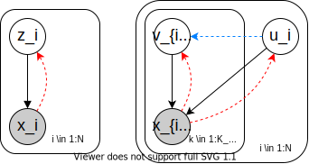
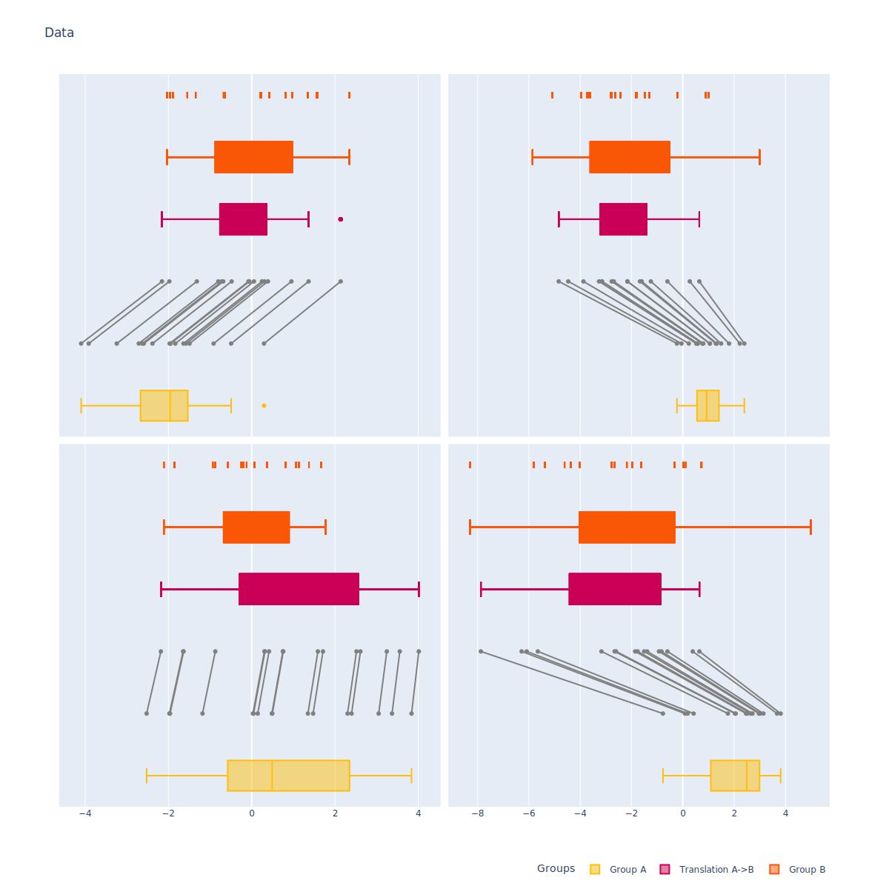
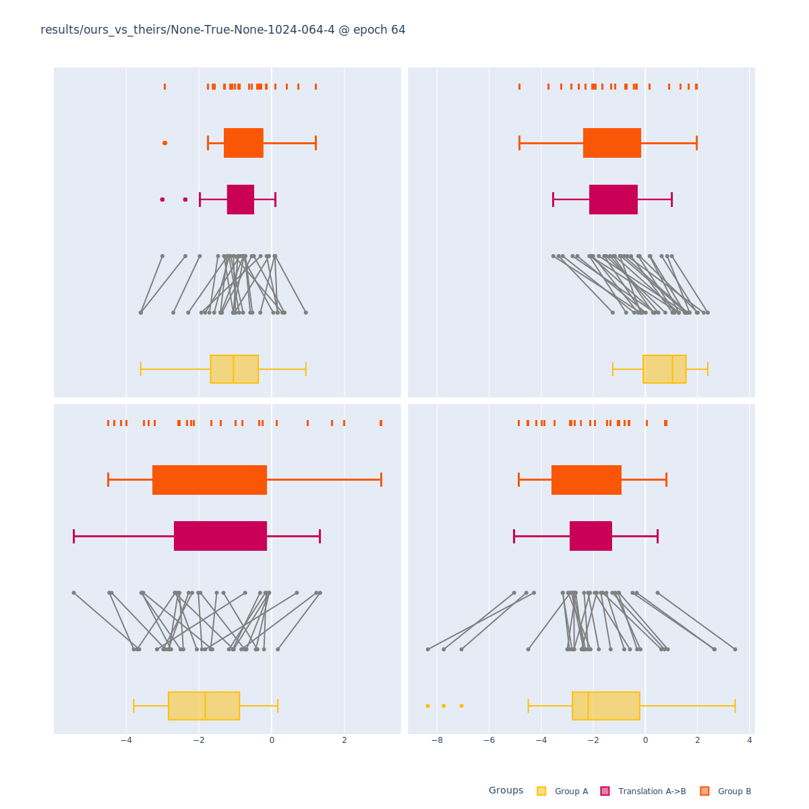
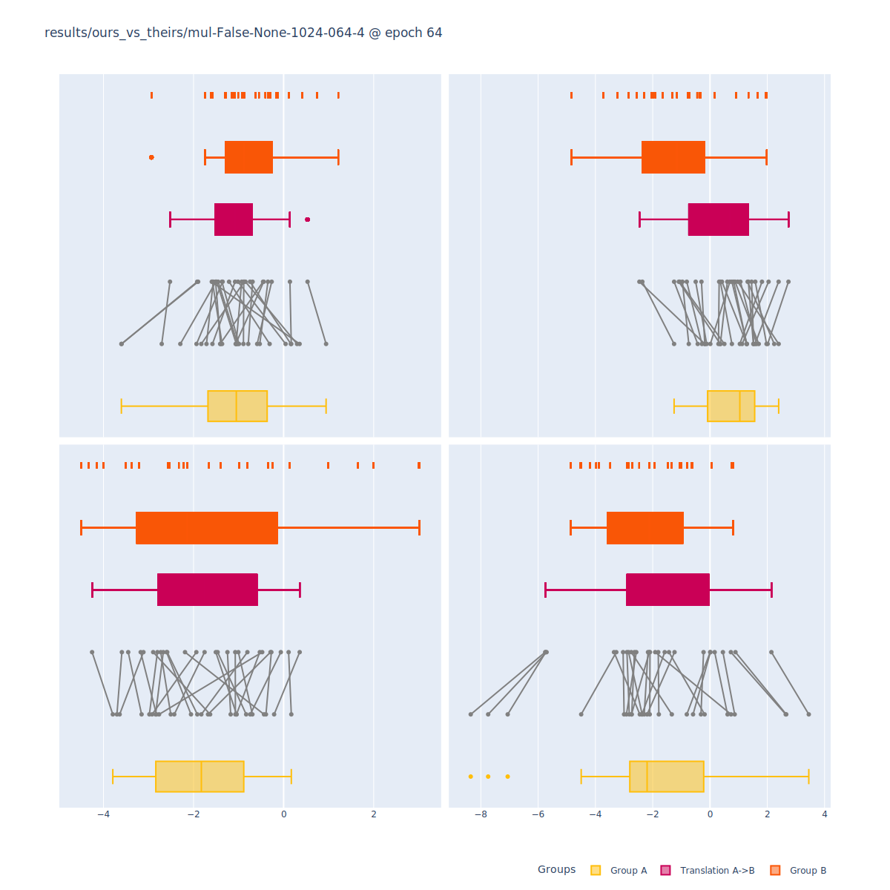
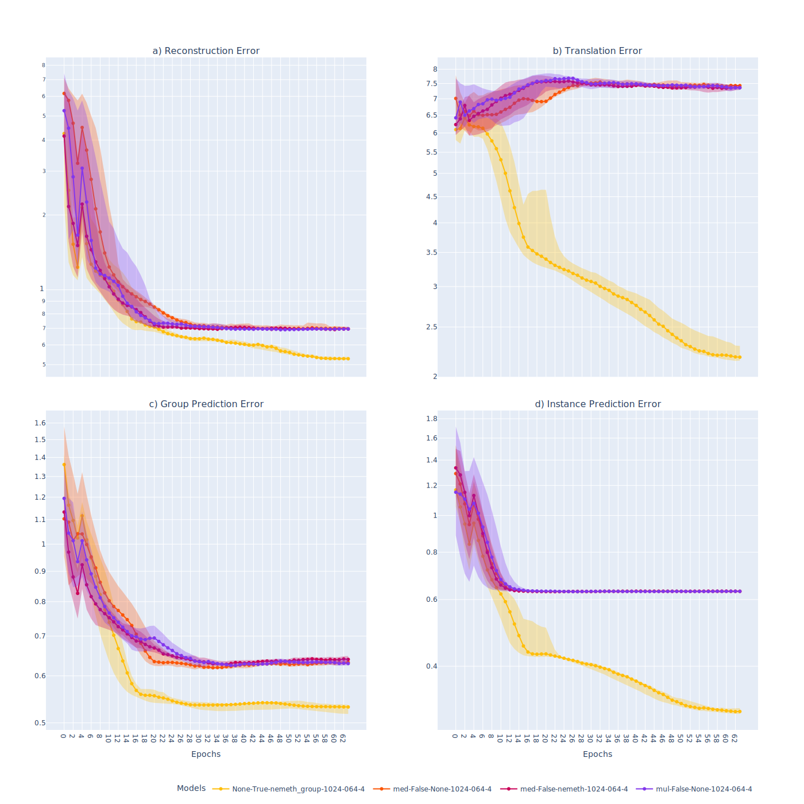

# Entangled Grouped Data
*Dan Andrei Iliescu*

## **1. Introduction**

We propose a modification to the Group Variational Autoencoder family which improves the model's performance on a class of problems that we call "entangled".

> **TODO:** Write introduction

## **2. Generative Group-Instance**

The Group Variational Autoencoder ([Bouchacourt2018MultiLevelVA](https://api.semanticscholar.org/CorpusID:1209557), [Hosoya2019GroupbasedLO](https://api.semanticscholar.org/CorpusID:199466320)) is a family of models that use two latent variables to represent grouped data: one that captures the variation within groups, and one for the variation across groups.

Assume a dataset of the form $x_{[1:N,~1:K_i]} = \{x_{ik}\}_{i \in 1:N, ~k \in 1:K_i}$ where $N$ is the number of groups and $K_i$ is the number of observations in group $i$. GVAE defines a generative model that maps a $\mathcal{N} (0,1)$ group latent variable $u_i$ and a $\mathcal{N} (0,1)$ instance latent variable $v_{ik}$ to a given data observation $x_{ik}$. In other words, the likelihood of a group is:

$$p(x_{[1:K]}) = \mathbb{E}_{p(u)}  \prod_{k=1}^{K} \mathbb{E}_{p(v_{k})} ~ [p(x_{k} | u, v_{k})]$$

We omit the index of the group $i$ for notational simplicity, since the groups are independent and identically distributed.



> **Figure 1:** Probabilistic graphical model of the VAE (left) and the GVAE (right). The dotted arrows depict the variational latent posterior, and the blue arrow shows a dependency which is absent from the GVAE but present in our proposed model.

### **2.1 Variational Inference**

Because the exact likelihood is intractable, the Variational Autodencoder ([Kingma2014AutoEncodingVB](https://api.semanticscholar.org/CorpusID:216078090), [JimenezRezende2014StochasticBA](https://api.semanticscholar.org/CorpusID:16895865)) performs optimization by introducting a variational latent posterior $q(u, v_{[1:K]} | x_{[1:K]})$ and maximizing the Evidence Lower Bound ([Jordan2004AnIT](https://api.semanticscholar.org/CorpusID:2073260)):

$$\log p(x_{[1:K]}) \geq \mathbb{E}_{q(u, v_{[1:K]} | x_{[1:K]})} [\log p(x_{[1:K]} | u, v_{[1:K]})] - \mathrm{KL} [q(u, v_{[1:K]} | x_{[1:K]}) || p(u, v_{[1:K]})]$$

*The models in the GVAE family use a class of variational distributions that assume independence between the latent variables in a group when conditioned on the data.*

$$q(u, v_{[1:K]} | x_{[1:K]}) = q(u | x_{[1:K]}) \prod_{k=1}^K q(v_k | x_k)$$

In our work, we show that this assumption hinders disentanglement when the generative model is entangled.

### **2.2 Group Encoder**

The variational group posterior is realised as normal density with $\mu, \Sigma$ computed with an encoder network. The way to implement the encoder network is not obvious, since the number of inputs $K$ varies across groups. [Hosoya2019GroupbasedLO](https://api.semanticscholar.org/CorpusID:199466320) encode separately each observation in the group using the same encoder $E_u$ to produce $\mu_k, \Sigma_k$ and then averages the outputs.

$$\mu = \frac{1}{N} \sum_{k=1}^K \mu_k, ~ \Sigma = \frac{1}{N} \sum_{k=1}^K \Sigma_k$$

[Bouchacourt2018MultiLevelVA](https://api.semanticscholar.org/CorpusID:1209557) also encode each observation individually and then accumulate the evidence through a product of normal densities, computed using the following equations:

$$\Sigma^{-1} = \sum_{k=1}^K \Sigma_k^{-1}, ~ \mu^T \Sigma^{-1} = \sum_{k=1}^K \mu_k^T \Sigma_k^{-1}$$

They justify that such a product of normals produces a valid evidence accumulation using the following result:

$$q(u | x_{[1:K]}) \propto \prod_{k=1}^K q(u | x_k)$$

However, the above is not a universal property, since

$$q(u | x_{[1:K]}) = \frac{\prod_{k=1}^K q(x_k)}{q(x_{[1:K]})} \frac{1}{q(u)^{K-1}} \prod_{k=1}^K q(u | x_k) \propto \frac{1}{q(u)^{K-1}} \prod_{k=1}^K q(u | x_k)$$

In fact, by using a product of normals to accumulate evidence, the authors implicitly assume that the marginal distribution of the inferred group variable is a uniform. This has the effect of sampling $u$ values which are less representative of the current group and more skewed towards the marginal distribution of $u$.

In our work, we propose a more general approach to encoding $u$ by using a Deep Sets  network ([Zaheer2017Deep](https://api.semanticscholar.org/CorpusID:4870287)) to encode the whole set of observations instead of encoding each observation separately.

### **2.3 Regularization**

In certain cases, the model might learn to encode both kinds of variation (within- and across-group) in the instance variable, effectively turning the model into a standard VAE. In this eventuality, the group variable becomes irrelevant and disentanglement is not achieved.

Such behaviour has been identified by [Hosoya2019GroupbasedLO](https://api.semanticscholar.org/CorpusID:199466320) and [Nemeth2020Adversarial](https://api.semanticscholar.org/CorpusID:210472540) to occur when the instance code too high-dimensional, the instance encoder too expressive, or group sizes too small. One solution is to limit the dimensionality of the instance code ([Hosoya2019GroupbasedLO](https://api.semanticscholar.org/CorpusID:199466320)), with the downside of hindering the overall model performance. 

As a more targeted solution, [Nemeth2020Adversarial](https://api.semanticscholar.org/CorpusID:210472540) propose an adversarial loss minimizing the mutual information between an observation and the instance variable inferred from the other observations in the group:

$$I_{r} (x, v) = \mathrm{KL} [r(x, v) || r(x) r(v)]$$

where $r(x, v) = r(v | x) r(x)$ is the joint distribution of an observation and the instance variable inferred from any of the other observations in the group and 

$$r(v | x_k) = \frac{1}{K - 1} \sum_{l=1, ~ l \neq k}^K q(v | x_l)$$

The mutual information is approximated empirically using the results of [Belghazi2018Mutual](https://api.semanticscholar.org/CorpusID:44220142).

$$I_{r} (x, v) \approx \max_{T} \mathbb{E}_{r(x, v)} [T(x, v)] - \log \mathbb{E}_{r(x)r(v)} [\exp T(x, v)]$$

$T$ is a neural network and the expectation terms are computed by sampling.

- To sample $r(x, v)$, first choose a group $i$, then choose two instances from that group $k, l \in K_i$. $x$ will be the observation $x_{ik}$ and $v$ will be sampled from $q(v | x_{il})$.
- To sample $r(x)r(v)$, choose two groups $i, j$ and two instances in each group $k \in K_i, l \in K_j$. Take $x_{ik}$ for $x$ and sample $q(v | x_{jl})$.

In our view, this method has the following limitation: Even when the instance variable does contain group information, the value of $I_{r} (x, v)$ might still be small, because it might be difficult to ascertain the group based on one single observation $x$. In our work, we propose a modification to this regularization term such that the network $T$ takes as input all the observations in the group instead of only one.

## **3. Entangled Group and Instance Variables**

We call the group and instance variables *entangled* when they are not independent conditioned on the data $p(u, v | x) \neq p(u | x) p(v | x)$. A useful heuristic for establishing whether the variables are entangled is to ask "Does knowing the group variable for an observation influence my belief about its instance variable?"

This property of the generative model is present in many machine learning tasks, such as collaborative filtering, 3D novel view synthesis. For example, in the context of the [Netflix Challenge](https://en.wikipedia.org/wiki/Netflix_Prize), where the task was to predict what score a user would give to a new film, one cannot infer what film is associated with a given score without also knowing the user.

*Strictly speaking, most real-world models are entangled. However, in many cases, the mutual information between the group and instance variable, conditioned on the observation, is negligible. For example, in handwritten digit recognition, one can infer the digit value depicted in an image without knowing the author.*

In this paper, we claim that the current methods in the GVAE family do not perform well in tasks where the group and instance variables are entangled.

### **3.1 Exam-Scores Problem**

Suppose we wanted to model the exam scores of students from different schools. Our model must separate the school-level effect (the group factor) from the student-level effect (the instance factor). We define the following generative model:

$$x_{ik} = 2 ~ \mu_i +  (\sigma^2_i + 1) v_{ik} + \epsilon_{ik}, ~ i \in 1:N, ~ k \in 1:K_i$$

where $x_{ij}$ is the student score, $u_i = (\mu_i, \sigma_i)$ is the school-level effect, $v_{ij}$ is the student-level effect, and $\epsilon_{ik}$ is a normally-distributed error term. We assume a $\mathcal{N} (0, 1)$ prior distribution for the latent variables.

We first sample the model to generate a dataset ($N = 32,768, ~ K_i \sim \mathrm{Poisson} (16) + 8$) and then use the same model as the generative model in our Variational Autoencoder, instead of a neural network. The figure below shows what the data looks like.


> **Figure 2:** Normalized exam scores of individual students grouped by school.

Looking at the data, it is easy to see that this model is entangled, because the relative performance $v$ of a student within their own school, given their absolute score $x$, depends on the distribution of scores within the school $u$.

## **4. Context-Aware Variational Autoencoder (CxVAE)**

We propose a new model which can perform well on datasets generated from entangled group and instance variable. We call our model the Context-Aware Variational Autoencoder. Our model comprises the following changes with respect to the standard GVAE:
1. The group encoder is implemented as a Deep Sets network ([Zaheer2017DeepS](https://api.semanticscholar.org/CorpusID:4870287)). The encoder has the following form:
   $$\mu, \Sigma = E_u (x_{[1:K]}) = E^B_u \left( \sum_{k=1}^K E^A_u (x_k)\right)$$
   where $E^A_u, E^B_u$ are two neural networks.
2. The variational instance posterior is dependent on the inferred group variable:
   $$q(u, v_{[1:K]} | x_{[1:K]}) = q(u | x_{[1:K]}) \prod_{k=1}^K q(v_k | x_k, u)$$
   In practice, our instance encoder takes as input a vector concatenating $x_k$ and $u$. This idea is not new, and has been used previously in sequence disentanglement ([Li2018Disentangled](https://api.semanticscholar.org/CorpusID:48353305)). This allows the instance encoder to differentiate the between observations with similar values but which come from different groups.
3. We propose a regularization objective similar to the one in [Nemeth2020Adversarial](https://api.semanticscholar.org/CorpusID:210472540), but whereby we minimize *the mutual information between one inferred instance variable and all the other observations in the group*. More precisely, our objective is to minimize $I_r (x_{[-k]}, v_k)$ where $r(v_k | x_{[-k]}) = q(v_k | x_k, u)$. Following the same approximation as in [Nemeth2020Adversarial](https://api.semanticscholar.org/CorpusID:210472540), the objective takes the following form:
    $$I_{r} (x_{[-k]}, v_k) \approx \max_{T} ~ \mathbb{E}_{r(x_{[-k]}, v_k)} [T(x_{[-k]}, v_k)] - \log \mathbb{E}_{r(x_{[-k]}) r(v_k)} [\exp T(x_{[-k]}, v_k)]$$
    $T$ is implemented as a Deep Sets neural network for the observations, with the instance code concatenated in the middle:
    $$T(x_{[-k]}, v_k) = T^\beta \left(v_k, \frac{1}{K} \sum_{l=1, ~ l \neq k}^K T^\alpha (x_l) \right)$$
    Again, the expectations are computed by sampling:
    - To sample $r(x, v)$, first choose a group $i$, then choose one instance from that group $k \in K_i$. $x_{[i, -k]}$ will be all the observations in the group apart from $k$, and $v_k$ will be sampled from $q(v | x_{ik})$.
    - To sample $r(x_{[-k]})r(v_k)$, choose two groups $i, j$ and two instances in each group $k \in K_i, ~ l \in K_j$. Take $x_{[i, -k]}$ for $x_{[-k]}$ and sample $q(v | x_{jl})$.
    
    This regularization objective also minimizes the mutual information between the inferred instance variables and the true data generating group variable, but uses as a proxy for the latter all but one of the observations in the group, instead of just one observation.

## **5. Measuring Disentanglement**

In the context of the GVAE family, disentanglement is a property of the variational latent posterior. The inferred group and instance variables are disentangled when they are maximally informative about the group and instance variables of the true data generating distribution. We assume this true model has the same factorization of the joint distribution as the generative model, but the parameters are unknown.

Therefore, we can use the mutual information between the true and inferred latents as a measure of disentanglement.

$$I(U^t; U^q) = \mathrm{KL} [\mathrm{Pr}_{U^q, U^t} || \mathrm{Pr}_{U^q} \mathrm{Pr}_{U^t}]$$
$$= \mathbb{E}_{U^q} \mathbb{E}_{U^t | U^q} \left[ \log \frac{\mathrm{Pr}_{U^t | U^q}}{\mathrm{Pr}_{U^t}} \right]$$
and since $\mathrm{Pr}_{U^t}$ does not depend on $q$
$$= \mathbb{E}_{U^q} \mathbb{E}_{U^t | U^q} [ \log \mathrm{Pr}_{U^t | U^q}] + \mathrm{const}$$

We estimate the density $\mathrm{Pr}_{U^t | U^q}$ by training a regression network to predict the value of $U^t$ given $U^q$. The mean-squared error of the prediction on the holdout set is a monotonic function of the mutual information with respect to changes in $q$.

> **TODO:** Decide what notation to use. Is engineering notation sufficient, or do we need to separate between density functions and random variables? I'm also playing a bit fast and loose with the indices.

```python
def measure_disentanglement(train_x, test_x, q):
    # Intialize latent transformation nets
    u_net = Net()
    v_net = Net()
    # For each group in the training set, train transformation nets
    for x, u, v in train_x:
        # Sample inferred latent variables
        u_inf, v_inf = q(x)
        # log-likelihood of ground-truth given inferred latents
        u_rec = u_net(u_inf)
        v_rec = v_net(v_inf)
        loss = (u_rec - u)**2 + sum((v_rec - v)**2)
        # Update network weights
        u_net.step(loss)
        v_net.step(loss)
    # Initialize error terms
    u_error = 0
    v_error = 0
    # For each group in the testing set, 
    for x, u, v in test_x:
        # Same as during training
        u_inf, v_inf = q(x)
        u_rec = u_net(u_inf)
        v_rec = v_net(v_inf)
        # Update error terms
        u_error += (u_rec - u)**2
        v_error += sum((v_rec - v)**2)
    return u_error, v_error  
```

> **Algorithm 1:** Measuring disentanglement by the accuracy of a network which predicts the true latent variables from the inferred latent variables.

### **5.1 Unsupervised Translation**

Unsupervised translation is the process of transforming an observation by changing its group code while keeping its instance code fixed. This is a common downstream task for disentangled representations because it requires a clean separation between the group and instance representations ([Tenenbaum2000Separating](https://api.semanticscholar.org/CorpusID:9492646)). Therefore, it can be used to quantify the quality of disentanglement.

Formally, let $i, j$ be the indices of the source and target group, respectively. Translation involves sampling a group of instance codes from the source group $q(v_{[i,1:K_i]} | x_{[i,1:K_i]})$ and a group code from the target group $q(u_j | x_{[j,1:K_j]})$. Then, we generate the translated observations by combining each instance code with the group code $p(x'_{k} | u_j, v_{[i, 1:K_i]})$.

We measure translation quality by taking the mean-squared error between the translation performed with each model and the ground-truth translation computed using the ground-truth factors and the true data-generating process.



> **Figure 2:** Example of translation on the Exam-Scores dataset. The yellow and orange show the distributions of the source and target group, respectively. The red shows the distribution of the translated group. The grey lines show the translation of individual observations from the source to the target. We expect a good translation to have the translation lines uncrossed (the instance variable is preserved) and to have the same distribution as the target group (the group variable is changed).


## **6. Evaluation**

We test CxVAE against the other models from the GVAE family.

|  |  |
| ------------------- | --------------------- |

> **Figure 3:** Qualitative comparison of unsupervised translation between CxVAE (left) and ML-VAE ([Bouchacourt2018MultiLevelVA](https://api.semanticscholar.org/CorpusID:1209557)) (right). Our model captures the distribution of values in the target group better than the existing methods.

### **6.1 Quantitative Evaluation**



> **Figure 4:** Errors on the holdout set by training epoch. We compare CxVAE (ours, yellow) with [Bouchacourt2018MultiLevelVA](https://api.semanticscholar.org/CorpusID:1209557) (purple), [Hosoya2019GroupbasedLO](https://api.semanticscholar.org/CorpusID:199466320) (orange), and
[Nmeth2020AdversarialDW](https://api.semanticscholar.org/CorpusID:210472540) (red). For each model we perform 7 training runs, displaying the lowest, highest, and median error at each epoch.


| Model                                                                           | Rec Error          | Trans Error         | U Pred Error       | V Pred Error       |
| ------------------------------------------------------------------------------- | ------------------ | ------------------- | ------------------ | ------------------ |
| *CxVAE (ours)*                                                                  | **52.1** $\pm$ 0.6 | **219.5** $\pm$ 4.7 | **53.3** $\pm$ 1.2 | **30.2** $\pm$ 0.3 |
| [Bouchacourt2018MultiLevelVA](https://api.semanticscholar.org/CorpusID:1209557) | 69.8 $\pm$ 1.6     | 738.8 $\pm$ 13.6    | 63.4 $\pm$ 1.0     | 63.0 $\pm$ 0.3     |
| [Hosoya2019GroupbasedLO](https://api.semanticscholar.org/CorpusID:199466320)    | 71.9 $\pm$ 4.3     | 742.9 $\pm$ 14.4    | 63.1 $\pm$ 0.9     | 63.0 $\pm$ 0.4     |
| [Nmeth2020AdversarialDW](https://api.semanticscholar.org/CorpusID:210472540)    | 70.0 $\pm$ 1.4     | 735.3 $\pm$ 13.0    | 63.8 $\pm$ 1.1     | 63.0 $\pm$ 0.5     |

> **Table 1:** Comparison between errors on the holdout set of our model (CxVAE) and the rest of the GVAE family. CxVAE has the best performance across the 4 criteria. All errors are MSE, so lower is better. A mean error and standard deviation over the 7 training runs is taken at every epoch, and then the last 20 training epochs (44 - 64) are averaged in order to be displayed.

### **6.2 Ablation Study**

In order to quantify the effect of each proposed improvement, we perform an ablation study whereby we measure the decrease in performance resulting from replacing a proposed element of our model with a current alternative.

|                    | Rec Error          | Trans Error         | U-Pred Error       | V-Pred Error       |
| ------------------ | ------------------ | ------------------- | ------------------ | ------------------ |
| *CxVAE (ours)*     | **52.1** $\pm$ 0.6 | **219.5** $\pm$ 4.7 | **53.3** $\pm$ 1.2 | **30.2** $\pm$ 0.3 |
| **U Encoder**      |
| Average            | 53.6 $\pm$ 2.2     | 224.7 $\pm$ 10.0    | 53.4 $\pm$ 1.1     | 30.9 $\pm$ 1.1     |
| Multiplication     | 54.9 $\pm$ 2.8     | 229.2 $\pm$ 7.8     | 53.4 $\pm$ 0.9     | 31.4 $\pm$ 1.0     |
| **V Encoder**      |                    |                     |
| Unconditional      | 72.3 $\pm$ 3.6     | 729.0 $\pm$ 15.1    | 63.6 $\pm$ 1.2     | 63.0 $\pm$ 0.3     |
| **Regularization** |                    |                     |
| Unconditional IB   | 53.7 $\pm$ 1.2     | 225.7 $\pm$ 5.7     | 53.5 $\pm$ 1.1     | 30.8 $\pm$ 0.6     |
| None               | 54.1 $\pm$ 1.9     | 235.5 $\pm$ 16.5    | 53.6 $\pm$ 1.4     | 31.6 $\pm$ 1.5     |

> **Table 2:** Ablation study comparing CxVAE (our model) with alternative models obtained by replacing each of the novel components (group encoder, instance encoder and regularization). Each replacement leads to a worse performance across all criteria.

The proposed improvements have the best individual performance with respect to both reconstruction and translation error in each of the three categories. The choice of a group-aware instance encoder leads to the most significant increase in performance.